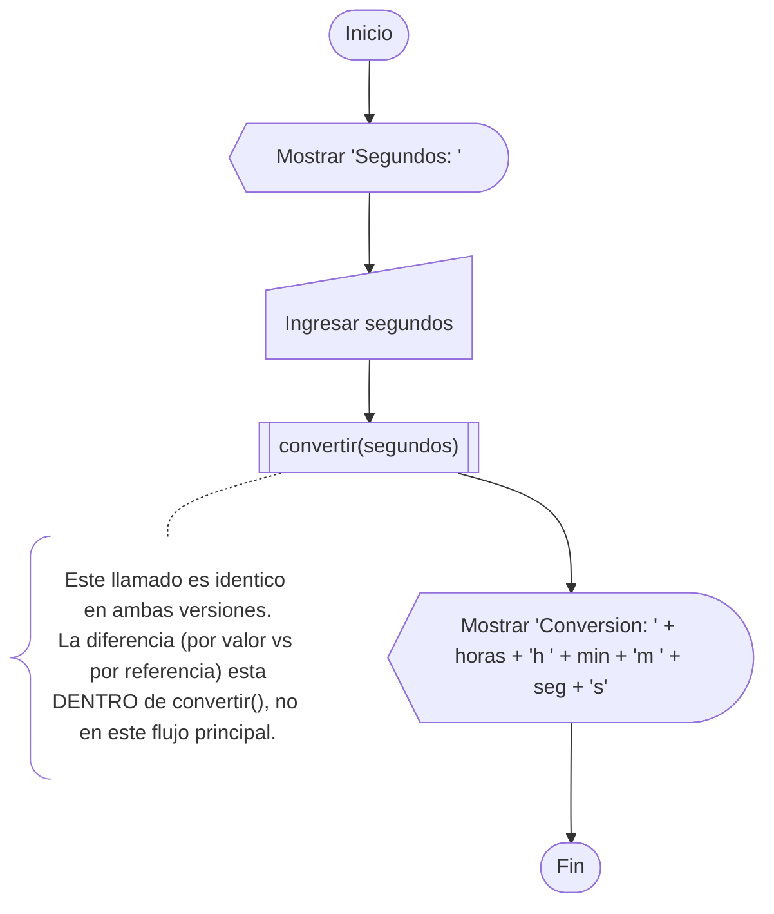
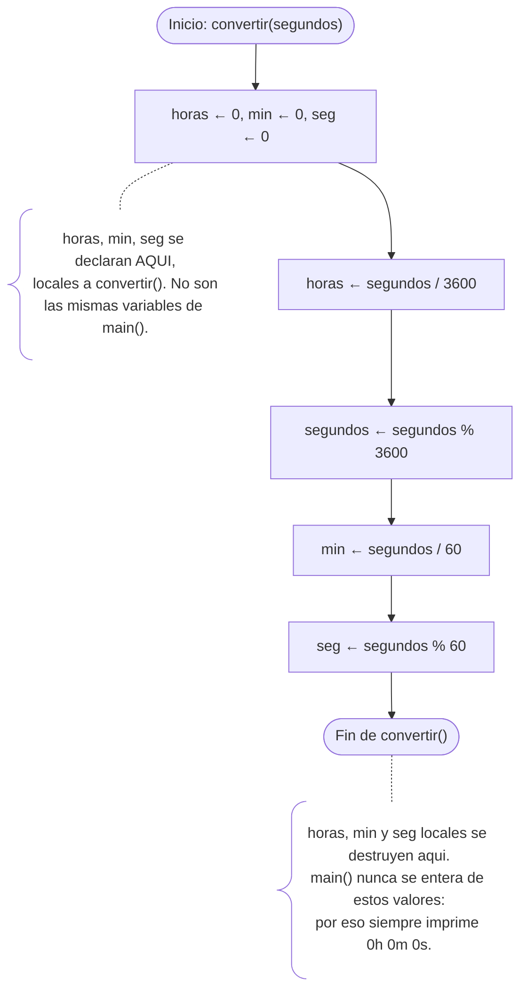
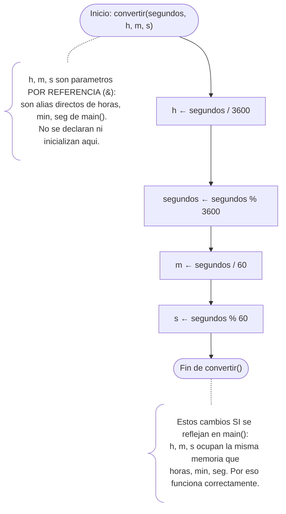

<title>Conversión Temporal</title>

# Diagrama principal (main) — igual para ambas versiones



# Diagrama de detalle — convertir() versión DEFECTUOSA



# Diagrama de detalle — convertir() versión CORREGIDA



Nota que, comparado con el diagrama defectuoso, este ya no tiene el nodo de inicialización (`h`, `m`, `s` no se declaran, ya existen como alias) y la nota final cambia de significado: en vez de "se pierden los valores", ahora "los cambios sí se reflejan en `main()`".

# Teoría: paso por valor vs. paso por referencia

## Paso por valor (`tipo nombre`)

Cuando un parámetro se pasa **por valor**, la función recibe una **copia** del dato original. Cualquier cambio que se haga dentro de la función afecta solo a esa copia; la variable original (la que existe fuera de la función) **nunca se entera** de esos cambios.

```cpp
void convertir(int segundos){       // "segundos" es una copia
    int horas=0, min=0, seg=0;      // variables LOCALES, nuevas, propias de esta función
    horas = segundos/3600;
    ...
}                                    // al terminar la función, horas/min/seg desaparecen
```

En la versión defectuosa, `horas`, `min` y `seg` ni siquiera son parámetros: son variables declaradas dentro de `convertir()`. Existen solo mientras la función se ejecuta y se destruyen al terminar. Por eso el programa siempre imprime `0h 0m 0s`: los valores calculados nunca llegan a `main()`.

## Paso por referencia (`tipo &nombre`)

Cuando un parámetro se pasa **por referencia** (con el símbolo `&`), la función no recibe una copia, sino un **alias** de la variable original. Es literalmente "otro nombre" para la misma casilla de memoria. Modificar el parámetro dentro de la función modifica directamente la variable original en `main()`.

```cpp
void convertir(int segundos, int &h, int &m, int &s){
    h = segundos/3600;   // esto modifica DIRECTAMENTE "horas" de main()
    ...
}
```

Aquí `h`, `m`, `s` son alias de `horas`, `min`, `seg` de `main()`. Por eso esta versión sí funciona: los cálculos hechos dentro de `convertir()` se reflejan afuera.

## ¿Cuándo usar cada uno?

| Situación | Usar |
|---|---|
| Solo necesito **leer** un valor dentro de la función, sin modificarlo afuera | Por valor |
| La función necesita **devolver más de un resultado** (parámetros de salida) | Por referencia |
| Quiero evitar copiar datos grandes (arreglos, structs, strings) por eficiencia | Por referencia (usualmente `const &` si no se debe modificar) |

**Idea clave:** `return` solo puede devolver **un** valor. Cuando una función necesita entregar varios resultados (como horas, minutos y segundos a la vez), la solución es usar **parámetros de salida por referencia**, tal como se hace en la versión corregida de `convertir()`.
