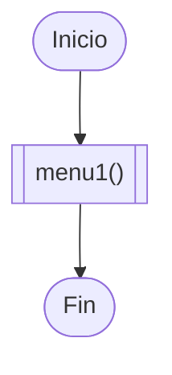
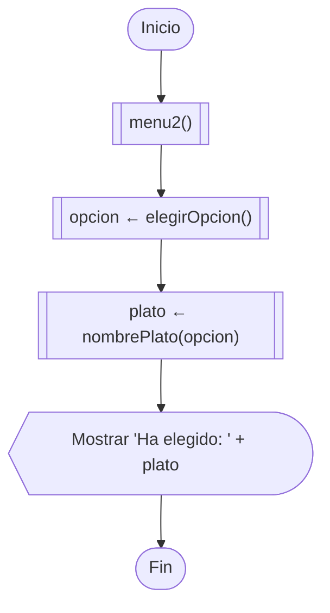
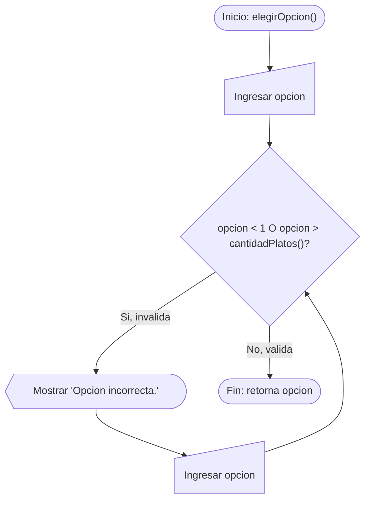

<title>Restaurante 6004</title>

# Diagrama principal — Version1_MenuSimple



# Diagrama principal — Version2_MenuValidado



# Diagrama de detalle — elegirOpcion()

Esta es la función clave que distingue la Version2 de la Version1: valida la opción con un bucle `while`.



# Teoría: el archivo `.h`

## ¿Qué es y para qué sirve?

Un archivo `.h` (header/cabecera) contiene **declaraciones**, no implementaciones: le dice al compilador "esta función existe, así se llama, esto recibe y esto devuelve", sin mostrar el código que hace el trabajo. La implementación real vive en el `.cpp` correspondiente.

Esto es necesario porque el compilador procesa cada `.cpp` **por separado**, de arriba hacia abajo. Si `main.cpp` llama a `elegirOpcion()`, pero esa función está definida en `menus.cpp`, el compilador necesita conocer su firma (nombre, parámetros, tipo de retorno) en el momento de compilar `main.cpp` — aunque el cuerpo real se compile en otro archivo distinto. El `.h` es esa firma, compartida entre ambos archivos vía `#include`.

```cpp
// menus.h — la "promesa"
int elegirOpcion();
```
```cpp
// menus.cpp — el cumplimiento de la promesa
int elegirOpcion(){
    ...
}
```

## ¿Por qué `#ifndef` / `#define` / `#endif`?

`#include` es literalmente copiar y pegar el contenido del archivo. Si el mismo header terminara pegado dos veces en un mismo `.cpp` (algo que pasa fácilmente cuando los headers se incluyen entre sí), cualquier constante o tipo definido ahí generaría un error de "redefinición". El patrón:

```cpp
#ifndef MENUS_H
#define MENUS_H
... contenido ...
#endif
```

hace que, la primera vez, el contenido se procese normalmente (y se deje la marca `MENUS_H` puesta); la segunda vez, como la marca ya existe, el preprocesador salta todo el contenido sin volver a pegarlo. Se le llama **include guard**.

## ¿Qué va en el `.h` y qué se queda en el `.cpp`?

Solo lo que otros archivos necesiten usar directamente (las funciones que `main.cpp` va a llamar). Los detalles internos de cómo está resuelta la función — como la lista de platos o la constante `NUM_PLATOS` en `Version2_MenuValidado` — se quedan dentro del `.cpp`, ocultos detrás de las funciones. `main.cpp` nunca necesita ver esos detalles: solo necesita poder llamar a `menu2()`, `elegirOpcion()` y `nombrePlato()`.

## `std::string` vs `string`

Si el `.h` no tiene `using namespace std;`, cualquier tipo que pertenezca al namespace `std` (como `string`, que en realidad se llama `std::string`) debe escribirse con el prefijo completo: `std::string nombrePlato(int opcion);`. `int` y `void` no necesitan prefijo porque son tipos del lenguaje, no del namespace `std`.

**Por qué el `.h` no lleva `using namespace std;`:** esa línea se copiaría en cada `.cpp` que incluya el header, forzando ese namespace en archivos que quizás no lo quieren. Por convención, `using namespace std;` solo se pone en archivos `.cpp`, nunca en un `.h`.
