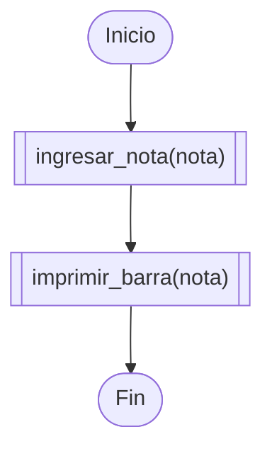
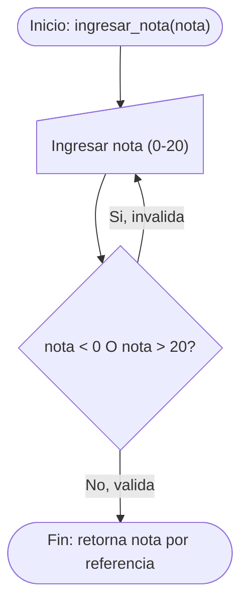
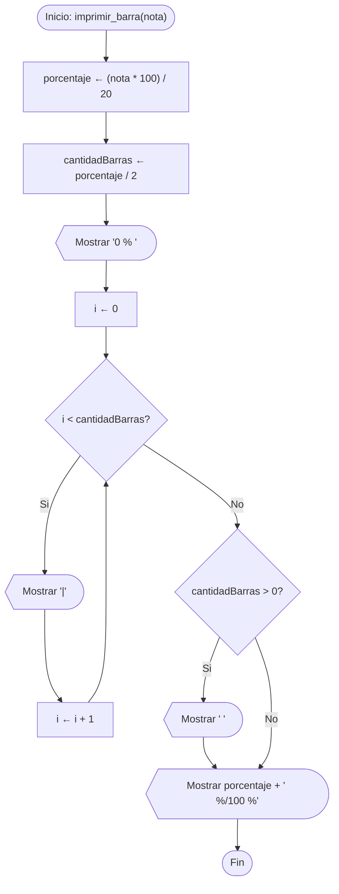
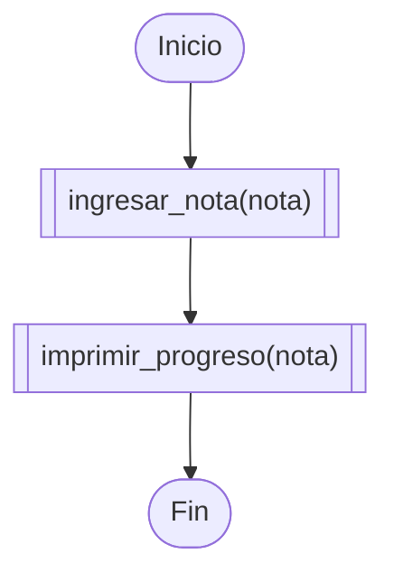
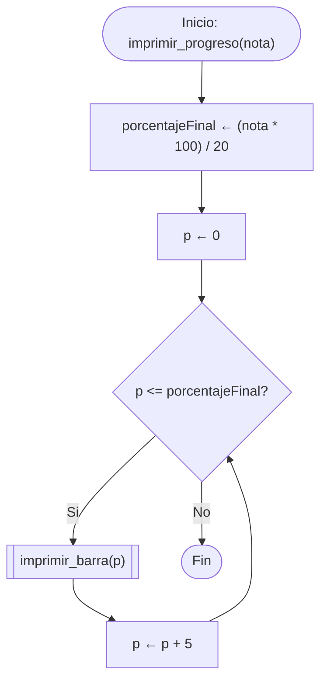

<title>Barra de Progreso</title>

# Diagrama principal — Parte1_BarraFinal



# Diagrama de detalle — ingresar_nota()

Idéntica en Parte1 y Parte2: valida con un `do-while` que la nota esté entre 0 y 20.



# Diagrama de detalle — imprimir_barra() (version Parte1)



# Diagrama principal — Parte2_Progreso



# Diagrama de detalle — imprimir_progreso()

Llama a `imprimir_barra()` repetidamente, subiendo el porcentaje de 5 en 5, desde 0 hasta el porcentaje final.



# Teoría: declaración adelantada vs. archivo `.h`

## Declaración adelantada (forward declaration)

En **Parte1_BarraFinal**, todo el programa vive en un único `main.cpp`. Los prototipos se escriben arriba, antes de `main()`, y las implementaciones reales se escriben después:

```cpp
void ingresar_nota(int&);   // declaracion adelantada
void imprimir_barra(int);   // declaracion adelantada

int main(){
    ingresar_nota(nota);    // el compilador ya conoce la firma
    imprimir_barra(nota);
    return 0;
}

void ingresar_nota(int &nota){ ... }   // implementacion real, mas abajo
void imprimir_barra(int nota){ ... }
```

El compilador lee de arriba hacia abajo, una sola vez, dentro del mismo archivo. Si `main()` llamara a una función que el compilador aún no conoce, sería un error de "función no declarada" — igual que pasaría con un `.h`. La declaración adelantada resuelve esto **sin salir del mismo archivo**: basta con escribir el prototipo antes de usarlo.

## Archivo `.h`

En **Parte2_Progreso**, el programa se divide en tres archivos (`funciones.h`, `funciones.cpp`, `main.cpp`). Ahí ya no alcanza con una declaración adelantada dentro de un solo archivo, porque **dos archivos distintos** (`main.cpp` y `funciones.cpp`) necesitan conocer las mismas firmas. La declaración compartida se saca a un archivo aparte (`funciones.h`) que ambos incluyen con `#include "funciones.h"`.

## La diferencia real

Es exactamente el mismo concepto — "avisarle al compilador que una función existe antes de usarla" — aplicado en dos escalas distintas:

| | Declaración adelantada | Archivo `.h` |
|---|---|---|
| Dónde vive la declaración | Arriba, en el mismo `.cpp` | En un archivo `.h` aparte |
| Cuántos archivos la comparten | Solo ese `.cpp` | Todos los `.cpp` que lo incluyan |
| Cuándo conviene | El programa cabe en un solo archivo | Varios `.cpp` necesitan llamar a las mismas funciones |

**Por qué Parte1 no necesita `.h` y Parte2 sí:** en Parte1 solo existe `main.cpp` — nadie más necesita conocer `ingresar_nota()` ni `imprimir_barra()`. En Parte2, `main.cpp` necesita llamar a funciones que están *implementadas* en `funciones.cpp`, un archivo distinto que se compila por separado — ahí una declaración adelantada dentro de `main.cpp` no alcanza, porque el compilador de `funciones.cpp` también necesita ver esas mismas firmas para verificar que la implementación coincide con lo prometido. Por eso se comparte vía `.h`, en vez de repetir el prototipo a mano en cada archivo.
