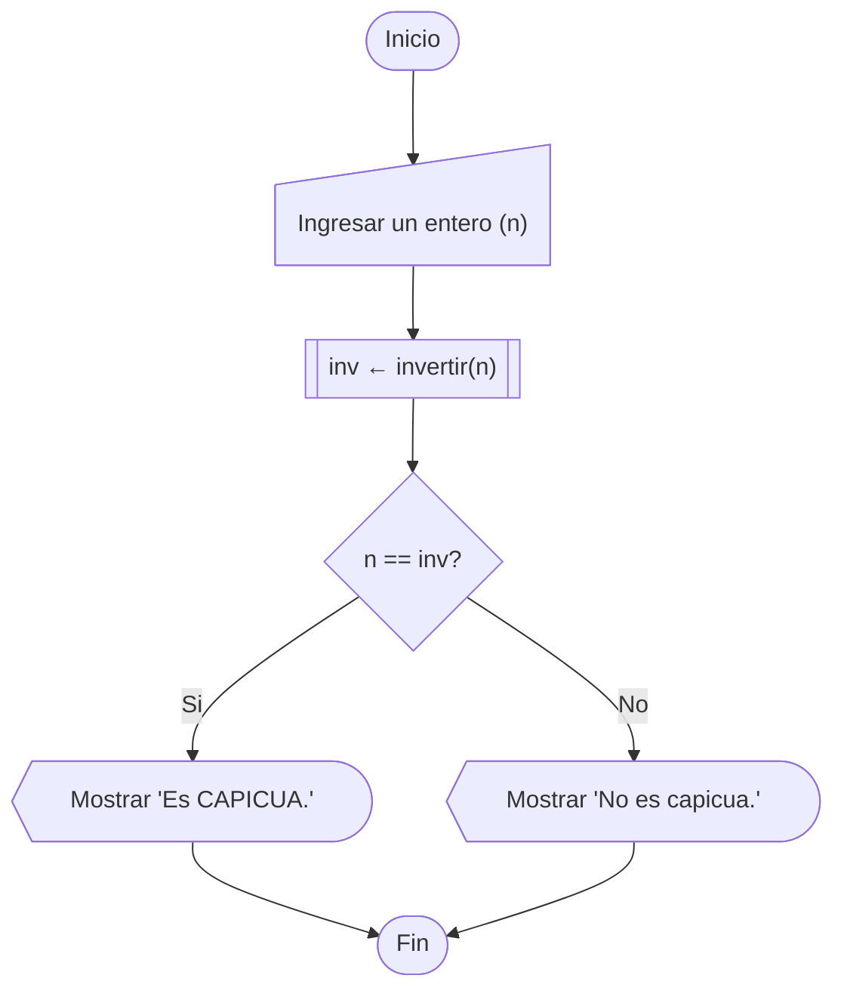
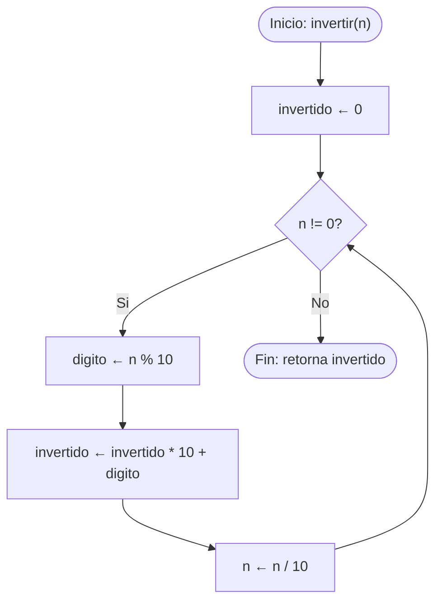

<title>Ejercicio 1 - Capicúa</title>

# Diagrama principal

```mermaid
flowchart TD
    INICIO(["Inicio"])
    LEER@{ shape: manual-input, label: "Ingresar un entero (n)" }
    LLAMAR[["inv ← invertir(n)"]]
    COND{"n == inv?"}
    MOSTRAR1@{ shape: curv-trap, label: "Mostrar 'Es CAPICUA.'" }
    MOSTRAR2@{ shape: curv-trap, label: "Mostrar 'No es capicua.'" }
    FIN(["Fin"])

    INICIO --> LEER --> LLAMAR --> COND
    COND -->|Si| MOSTRAR1 --> FIN
    COND -->|No| MOSTRAR2 --> FIN
```

# Diagrama de detalle — invertir()

```mermaid
flowchart TD
    INICIO2(["Inicio: invertir(n)"])
    INIT["invertido ← 0"]
    COND2{"n != 0?"}
    CALC1["digito ← n % 10"]
    CALC2["invertido ← invertido * 10 + digito"]
    CALC3["n ← n / 10"]
    FIN2(["Fin: retorna invertido"])

    INICIO2 --> INIT --> COND2
    COND2 -->|Si| CALC1 --> CALC2 --> CALC3 --> COND2
    COND2 -->|No| FIN2
```
