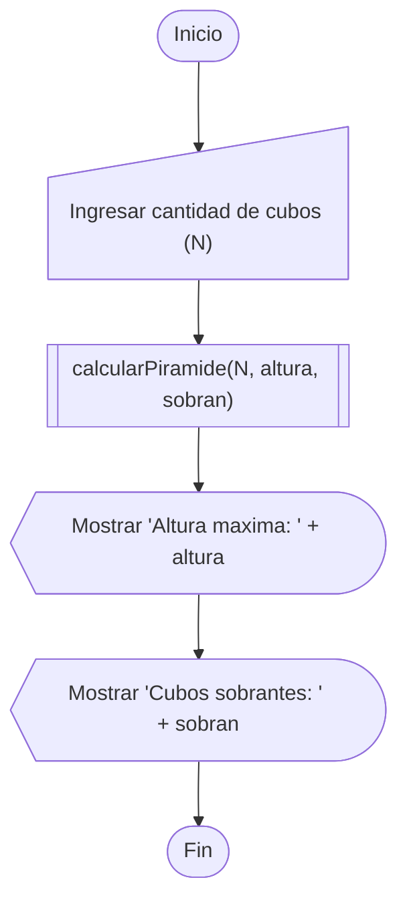
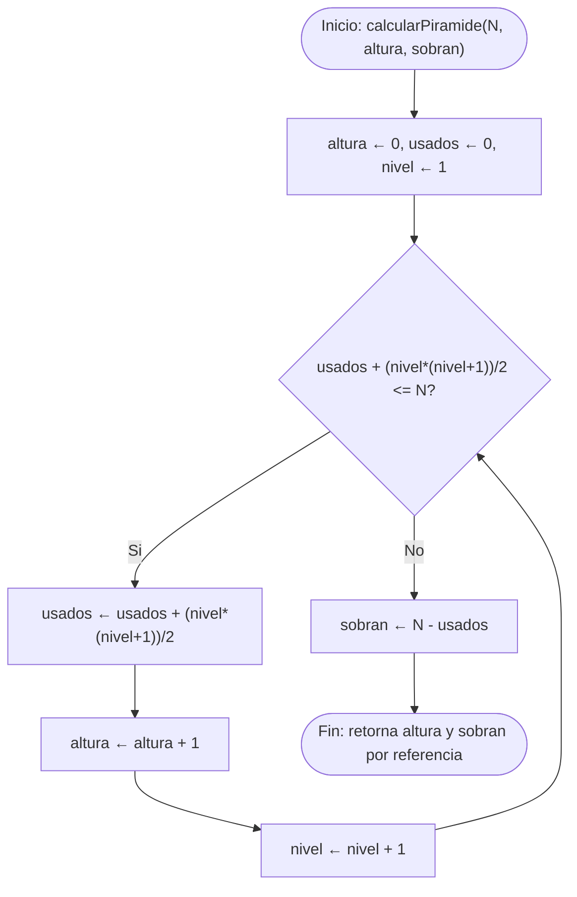

<title>Ejercicio 2 - La Pirámide</title>

# Diagrama principal

```mermaid
flowchart TD
    INICIO(["Inicio"])
    LEER@{ shape: manual-input, label: "Ingresar cantidad de cubos (N)" }
    LLAMAR[["calcularPiramide(N, altura, sobran)"]]
    MOSTRAR1@{ shape: curv-trap, label: "Mostrar 'Altura maxima: ' + altura" }
    MOSTRAR2@{ shape: curv-trap, label: "Mostrar 'Cubos sobrantes: ' + sobran" }
    FIN(["Fin"])

    INICIO --> LEER --> LLAMAR --> MOSTRAR1 --> MOSTRAR2 --> FIN
```

# Diagrama de detalle — calcularPiramide()

```mermaid
flowchart TD
    INICIO2(["Inicio: calcularPiramide(N, altura, sobran)"])
    INIT["altura ← 0, usados ← 0, nivel ← 1"]
    COND2{"usados + (nivel*(nivel+1))/2 &lt;= N?"}
    ACC["usados ← usados + (nivel*(nivel+1))/2"]
    INC1["altura ← altura + 1"]
    INC2["nivel ← nivel + 1"]
    CALC_SOBRAN["sobran ← N - usados"]
    FIN2(["Fin: retorna altura y sobran por referencia"])

    INICIO2 --> INIT --> COND2
    COND2 -->|Si| ACC --> INC1 --> INC2 --> COND2
    COND2 -->|No| CALC_SOBRAN --> FIN2
```
