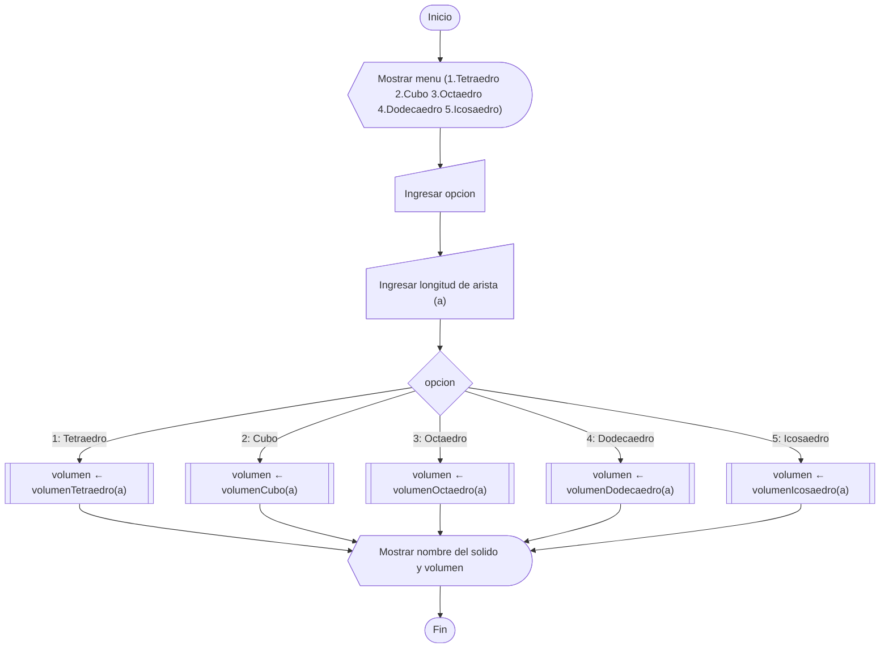

<title>Ejercicio 3 - Poliedros Regulares</title>

# Diagrama principal

```mermaid
flowchart TD
    INICIO(["Inicio"])
    MOSTRAR_MENU@{ shape: curv-trap, label: "Mostrar menu (1.Tetraedro 2.Cubo 3.Octaedro 4.Dodecaedro 5.Icosaedro)" }
    LEER_OPCION@{ shape: manual-input, label: "Ingresar opcion" }
    LEER_ARISTA@{ shape: manual-input, label: "Ingresar longitud de arista (a)" }
    DECISION{"opcion"}
    V1[["volumen ← volumenTetraedro(a)"]]
    V2[["volumen ← volumenCubo(a)"]]
    V3[["volumen ← volumenOctaedro(a)"]]
    V4[["volumen ← volumenDodecaedro(a)"]]
    V5[["volumen ← volumenIcosaedro(a)"]]
    MOSTRAR_RESULTADO@{ shape: curv-trap, label: "Mostrar nombre del solido y volumen" }
    FIN(["Fin"])

    INICIO --> MOSTRAR_MENU --> LEER_OPCION --> LEER_ARISTA --> DECISION
    DECISION -->|1: Tetraedro| V1 --> MOSTRAR_RESULTADO
    DECISION -->|2: Cubo| V2 --> MOSTRAR_RESULTADO
    DECISION -->|3: Octaedro| V3 --> MOSTRAR_RESULTADO
    DECISION -->|4: Dodecaedro| V4 --> MOSTRAR_RESULTADO
    DECISION -->|5: Icosaedro| V5 --> MOSTRAR_RESULTADO
    MOSTRAR_RESULTADO --> FIN
```
